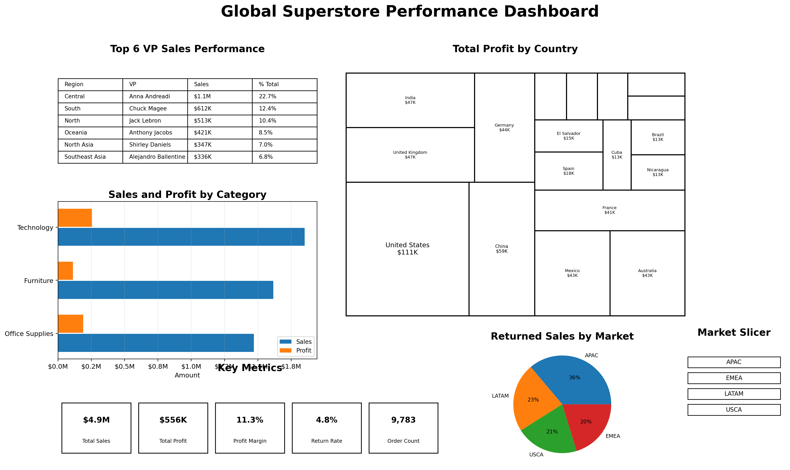
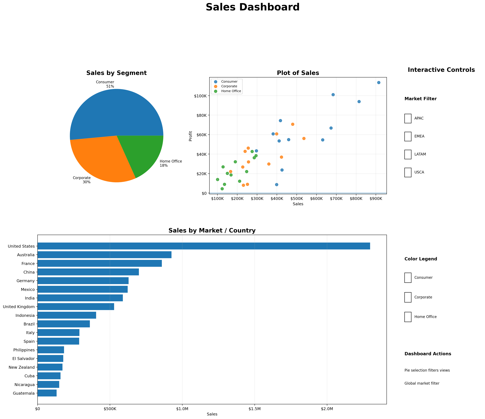
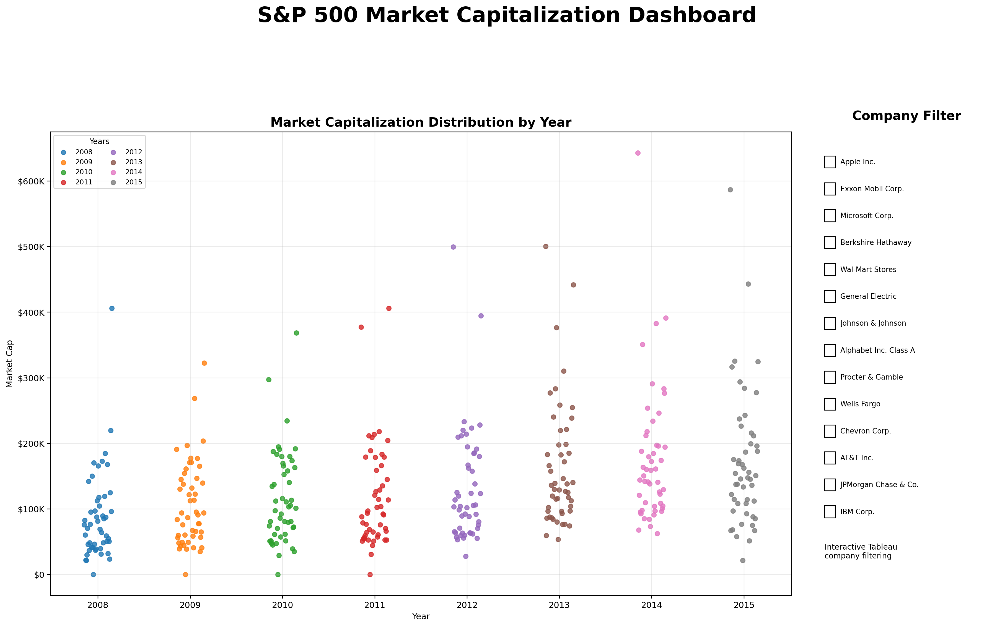
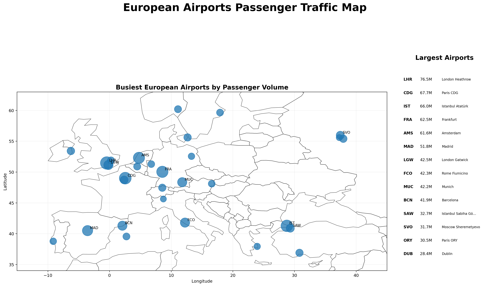

# Business Intelligence Dashboards

## Overview
This repository showcases my business intelligence and data visualization projects built in **Power BI** and **Tableau**. These dashboards focus on performance reporting, profitability analysis, returns tracking, market trends, geographic patterns, and interactive data exploration.

## Tools Used
- Power BI
- Tableau
- DAX Measures
- Data Modeling
- Table Relationships
- Drill-Down Analysis
- Dashboard Filters and Actions
- Geographic Mapping
- Interactive Business Reporting

---

# 1. Global Superstore Performance Dashboard
### Power BI Project

## Project Summary
I built an interactive Power BI report using the **Global Superstore** dataset to analyze sales, profitability, returns, country-level performance, and regional leadership performance.

### Dashboard Preview

## Key Features
- Created relationships between **Orders, People, and Returns** tables
- Built a drill-down bar chart for **Category and Sub-Category Sales and Profit**
- Created a returned-sales pie chart by **Market** that filters other visuals
- Designed a **Top 6 VP Sales Performance** table with regional sales and percentage of total sales
- Built a profit treemap by **Country**
- Added KPI-focused business performance visuals
- Created a global **Market slicer** to filter the full report

## Business Value
This dashboard supports quick decision-making by identifying:
- Product areas driving or weakening profitability
- Markets with higher returned sales
- Countries contributing stronger or weaker profit performance
- Top-performing regional sales leaders

---

# 2. Interactive Sales and Profit Dashboard
### Tableau Project

## Project Summary
I created an interactive Tableau dashboard to analyze sales, regional profitability, product category performance, and negative-profit patterns across countries and customer segments.

### Dashboard Preview

## Key Features
- Evaluated which product categories produced the **lowest profit across regions**
- Identified **countries and customer segments generating negative profit**
- Used a pie chart as an interactive filter for dashboard exploration
- Applied a global **Market filter** across all views
- Used the **Segment color legend** to highlight meaningful data patterns
- Designed the dashboard for stakeholder self-service exploration

## Business Value
This dashboard helps leaders quickly diagnose:
- Regional product weaknesses
- Unprofitable customer or market segments
- Where business performance requires deeper review

---

# 3. S&P 500 Market Capitalization Dashboard
### Tableau Project

## Project Summary
I developed a Tableau dashboard to explore company market capitalization trends across the S&P 500, using filters, ranked views, and interactive visuals to compare firm performance over time.

### Dashboard Preview

## Key Features
- Built a dashboard focused on **company market capitalization analysis**
- Used sorting and ranking to compare firms
- Created interactive views for easier trend exploration
- Designed the layout to match a professional dashboard reference format
- Enabled users to examine market-cap patterns across companies and periods

## Business Value
This dashboard supports financial trend analysis by making large-scale company comparisons easier to interpret and explore.

---

# 4. European Airports Passenger Traffic Map
### Tableau Project

## Project Summary
I created a Tableau symbol map to compare passenger traffic across European airports using three-character IATA airport codes.

### Dashboard Preview

## Key Features
- Mapped airports geographically using Tableau
- Used **size and color** to compare passenger volumes
- Focused the analysis on the busiest airports in the dataset
- Reduced map clutter by using tooltips and removing unnecessary layers
- Added filters to support targeted exploration of airport traffic patterns

## Business Value
This visualization helps users quickly identify geographic concentration and high-traffic airport locations through an intuitive map-based view.

---

## Files Included
- `GlobalSuperstore_Aadil.pbix` – Power BI Global Superstore dashboard
- `Dashboard_AadilMunshi.twbx` – Tableau interactive sales and profit dashboard
- `M5_Assignenment_1.twbx` – Tableau S&P 500 market capitalization dashboard
- `EuropeanAirports_AadilMunshi.twbx` – Tableau European airports passenger map

## Portfolio Focus
These projects demonstrate my ability to:
- Transform raw business data into decision-ready dashboards
- Build interactive analytics experiences in Power BI and Tableau
- Use filtering, drill-downs, data relationships, and dashboard actions
- Translate data into practical performance insights for business users
